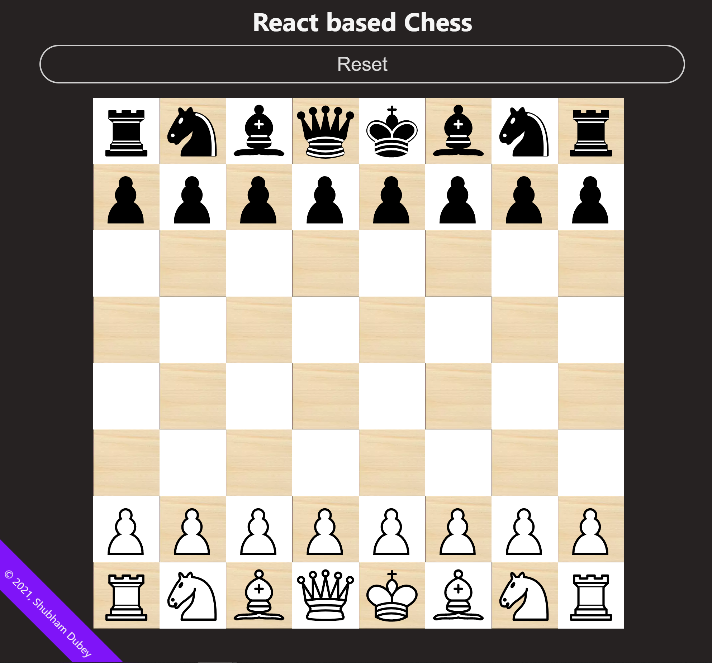

# React-based-chess webApp

This is a simple chess board inspired from my own personal project [Chess-javascript](https://github.com/Inert-one/Chess).
Though, This one is based on React-Redux, unlike the earlier one (JS). I gave it a new UI and Logical operations has also been changed as per React-environment.


## Installation && Running

You can setup and play with the code on your local machine by following these steps:
```
git clone https://github.com/Inert-one/Chess-react.git
cd ./react-chess && npm install
npm install
```
## Deployment

It's already live [here](https://react-chess-inert-one.vercel.app)
